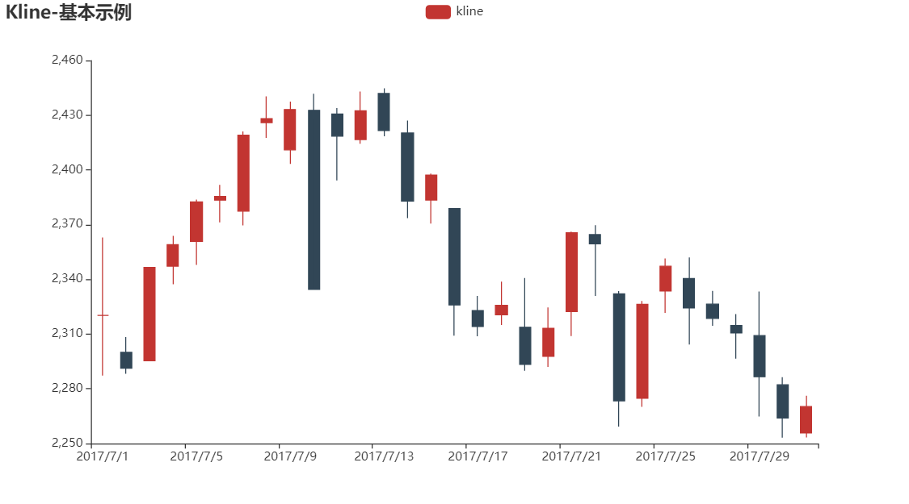

- # Visualization

  ### 可视化大作业 Interactive Dashboard

  ##### 引用模板连接：

  使用了pyecharts官方文档里的pyecharts-gallery里边画图的代码模板，并且进行了修改：1)增加了K线图中的均线，并且增加了一个滑动组件和缩放功能，还增加了十字线定位数据。2)在K线   图下方绘制了交易量柱状图，并于K线图的日期进行对应。

  

  https://gallery.pyecharts.org/#/README

  **最终结果连接：**

  https://crisripper777.github.io/

  #### 项目结构：

  - ##### 实现关于平安银行股份有限公司的信息以及股票交易数据的交互式可视化

  - ##### 股票交易数据可从一些 python 所带的金融数据接口获取

    目前采用第三方库 Tushare ，TuShare是基于Python的财经数据接口库，目的是实现对股票、期货、期权、基金、外汇、债券、指数、加密货币等金融产品的基本面数据、实时和历史行情数据、衍生数据从数据采集、数据清洗到数据落地的一套工具，主要用于学术研究目的。

    所获取个股历史交易数据的数据格式如下：

    | **date**   | **open** | **high** | **close** | **low** | **volume** | **price_change** | **p_change** | **ma5** | **ma10** | **ma20** | **v_ma5**  | **v_ma10** | **v_ma20** | **turnover** |
    | ---------- | -------- | -------- | --------- | ------- | ---------- | ---------------- | ------------ | ------- | -------- | -------- | ---------- | ---------- | ---------- | ------------ |
    | 2021-12-31 | 16.86    | 16.90    | 16.48     | 16.40   | 1750761.00 | -0.34            | -2.02        | 16.888  | 17.157   | 17.619   | 1174911.26 | 1003948.07 | 1159757.44 | 0.90         |
    | 2021-12-30 | 16.76    | 16.95    | 16.82     | 16.72   | 796663.62  | 0.07             | 0.42         | 17.054  | 17.266   | 17.677   | 922409.36  | 889108.94  | 1107599.38 | 0.41         |
    | 2021-12-29 | 17.16    | 17.16    | 16.75     | 16.70   | 1469373.88 | -0.42            | -2.45        | 17.154  | 17.356   | 17.716   | 974991.81  | 891390.52  | 1117506.11 | 0.76         |
    | 2021-12-28 | 17.22    | 17.33    | 17.17     | 17.09   | 1126638.88 | -0.05            | -0.29        | 17.282  | 17.436   | 17.760   | 876502.58  | 873915.89  | 1079383.68 | 0.58         |
    | 2021-12-27 | 17.33    | 17.35    | 17.22     | 17.16   | 731118.94  | -0.09            | -0.52        | 17.366  | 17.477   | 17.774   | 829921.62  | 954972.90  | 1059732.54 | 0.38         |
    | ...        | ...      | ...      | ...       | ...     | ...        | ...              | ...          | ...     |          |          |            |            |            |              |

  - ##### 股票交易数据可绘制 K 线图、每日最高点最低点分析图、股票运势图

  - ##### 公司信息数据同样可从Tushare接口或者百度获取，该数据可绘制公司对外投资区域分布图、对外投资行业分布图等

  - **得到以上数据进行交互式可视化，采用 python 的 pyecharts 库来绘制**

  - ##### 最后将所绘制得到的可视化结果使用 github.io 可免费部署到 web 

#### 参考资料：

1) pyecharts 官方文档 https://gallery.pyecharts.org/#/README
2) Tushare大数据开放社区，获取股票数据以及公司数据 https://tushare.pro/

 
